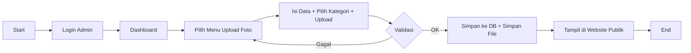
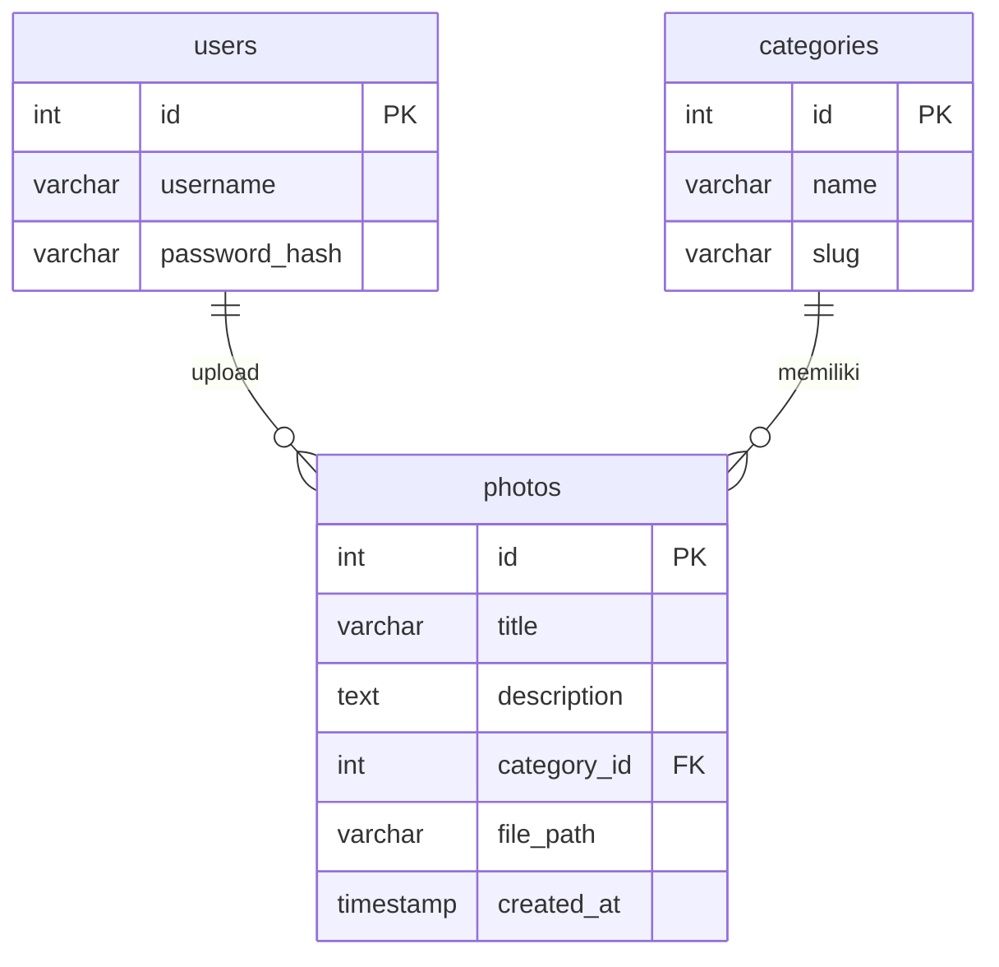

# Website Galeri Foto — PHP Native + MySQL

## Deskripsi
Aplikasi galeri foto dengan dua role:
- **Admin**: login, kelola kategori, kelola foto (upload/edit/hapus), dashboard statistik.
- **User (Publik)**: lihat beranda, galeri (filter kategori), dan detail foto.

Stack: PHP Native, MySQL, Bootstrap 5.

## Struktur Folder
```
/galeri-foto
├── index.php
├── galeri.php
├── detail.php
├── config.php
├── functions.php
├── /includes
│   ├── header.php
│   └── footer.php
├── /admin
│   ├── login.php
│   ├── logout.php
│   ├── dashboard.php
│   ├── kategori.php
│   ├── foto.php
│   └── seed_admin.php
├── /uploads
└── /assets
    ├── /css/style.css
    └── /js/app.js
```

## Instalasi Cepat
1. Import database:
   - Buka phpMyAdmin / terminal MySQL, jalankan `database.sql`.
2. Konfigurasi koneksi di `config.php` (DB_USER, DB_PASS, dll).
3. Buat admin default:
   - Jalankan `http://host/galeri-foto/admin/seed_admin.php` sekali. (Akan membuat **admin/admin123**)
4. Pastikan folder `uploads` memiliki izin tulis (writeable).
5. Akses:
   - Publik: `/index.php`
   - Admin: `/admin/login.php`

## Keamanan Singkat
- Password memakai `password_hash()` + `password_verify()` (bcrypt) md5.
- Query menggunakan prepared statements (menghindari SQL Injection).
- Form dilengkapi **CSRF token** dasar.
- Validasi MIME dan ekstensi saat upload gambar (jpg/png/webp).

## Flowchart
### Admin Upload Foto


### User Akses Galeri


## ERD (Sederhana)


> Catatan: relasi `users -> photos` tidak dipakai langsung pada skema tabel (kolom `user_id` ditiadakan agar sederhana). Bila ingin menautkan pengupload, tambahkan kolom `user_id` pada tabel `photos` + foreign key.

## Screenshot/Mockup (Deskripsi)
- **Beranda**: Banner sederhana, daftar kategori (button), grid foto terbaru.
- **Galeri**: Grid 4 kolom di desktop, 2 di mobile, pagination.
- **Detail**: Gambar besar di kiri, metadata + deskripsi di kanan.
- **Admin**: Dashboard dua kartu statistik, halaman CRUD tabel + form.

## Catatan Pengembangan
- Untuk hosting shared, set `BASE_URL` di `config.php` misalnya `'/galeri-foto'`.
- Tambah pagination di `index.php` bila koleksi besar.
- Tambah pencarian judul/desk di `galeri.php` (query LIKE).
- Pasang ukuran maksimal upload `php.ini` (`upload_max_filesize`, `post_max_size`).

## Lisensi
Bebas digunakan untuk pembelajaran/Tugas Akhir.
